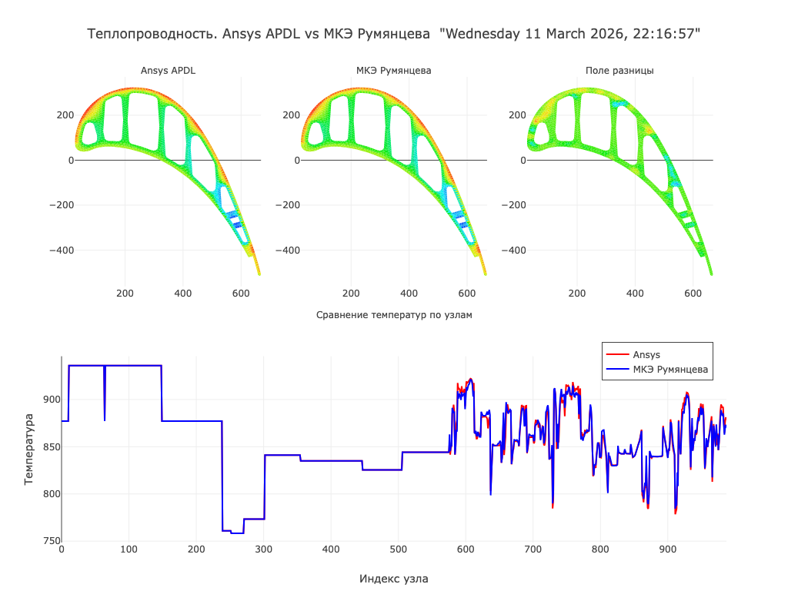

## Теплопроводность 2D: МКЭ Румянцева vs Ansys APDL

Инструмент командной строки на Rust для расчёта установившегося температурного поля в двумерной области методом конечных элементов (по теории Румянцева) и сравнения результата с расчётом Ansys APDL.  
Программа строит глобальную матрицу жёсткости, решает систему уравнений (плотным или разреженным методом) и визуализирует:

- распределение температуры по МКЭ;
- распределение температуры из Ansys APDL;
- поле разности между решениями;
- графики температур по номерам узлов.



---

## Возможности

- **Чтение входных данных из Ansys APDL**: файлы `NLIST.lis`, `ELIST.lis`, `DLIST.lis`, `PRNSOL.lis` парсятся с помощью `apdl-parser`.
- **Расчёт по МКЭ Румянцева**:
  - построение локальных матриц жёсткости для треугольных элементов;
  - сборка глобальной матрицы жёсткости;
  - учёт граничных условий по температуре.
- **Два режима решения СЛАУ**:
  - классическое LU‑разложение плотной матрицы (`nalgebra`);
  - разрежённые решатели (`russell_sparse`: KLU, UMFPACK, MUMPS).
- **Гибкая настройка коэффициентов теплопроводности**: `lambda_xx`, `lambda_yy`.
- **Визуализация результата**:
  - HTML-график в браузере (`plotly`);
  - сохранение изображения в форматах `svg`, `png`, `webp`, `jpeg` (по выбору).
- **Логирование** с выбором уровня (`info`, `debug`, `warn`) через `tracing`.

---

## Требования

- Установленный **Rust** (stable) с `cargo`.
- Наличие файлов, сгенерированных Ansys APDL:
  - `NLIST.lis` — список узлов;
  - `ELIST.lis` — список конечных элементов (треугольники);
  - `DLIST.lis` — граничные условия/заданные температуры;
  - `PRNSOL.lis` — результаты расчёта температур в узлах.

---

## Установка

Склонировать репозиторий и собрать проект:

```bash
git clone https://github.com/indraine/warm
cd warm
cargo build --release
```

Исполняемый файл будет находиться в:

```bash
target/release/warm
```

---

## Быстрый старт

Положите файлы `NLIST.lis`, `ELIST.lis`, `DLIST.lis`, `PRNSOL.lis` в ту же директорию, где запускается бинарник, и выполните:

```bash
./target/release/warm
```

По умолчанию:

- берутся файлы с именами `NLIST.lis`, `ELIST.lis`, `DLIST.lis`, `PRNSOL.lis` из текущей директории;
- используется разрежённый решатель **KLU**;
- коэффициенты теплопроводности: `lambda_xx = 0.0001`, `lambda_yy = 0.0001`;
- уровень логирования — `info`;
- результирующий график открывается в браузере.

---

## Интерфейс командной строки

Подробнее по всем параметрам можно посмотреть встроенную справку:

```bash
warm --help
```

Ниже пример типичного запуска через `cargo` с указанием основных настроек:

```bash
cargo run --release -- \
  --nlist ./files/NLIST.lis \
  --elist ./files/ELIST.lis \
  --dlist ./files/DLIST.lis \
  --prnsol ./files/PRNSOL.lis \
  --lambda-xx 0.15 \
  --lambda-yy 0.12 \
  --decomposition umfpack \
  --image png \
  --log-lvl debug
```

---

## Структура расчёта

- **`src/math.rs`**  
  Реализация математического ядра:
  - построение локальных матриц `b_e`, `c_e` и матрицы жёсткости элемента;
  - сборка глобальной матрицы жёсткости;
  - наложение граничных условий по температуре;
  - решение системы уравнений в плотном (`solve`) и разрежённом (`sparse_sol`) вариантах.

- **`src/visualize.rs`**  
  Визуализация результата:
  - поле температур Ansys APDL;
  - поле температур МКЭ Румянцева;
  - поле разности;
  - графики температур по узлам;
  - сохранение/открытие интерактивного графика.

- **`src/cli.rs`**  
  Описание аргументов командной строки (`clap`).

- **`src/main.rs`**  
  Точка входа: парсинг аргументов, чтение файлов, вызов решателя и визуализации, логирование времени выполнения.

---

## Теоретическая основа

Реализация следует классической постановке стационарной задачи теплопроводности и использует метод конечных элементов по Румянцеву (треугольные элементы, линейная аппроксимация).  

---

## Лицензия

Добавьте сюда информацию о лицензии, если она требуется (например, MIT/Apache-2.0 и т.п.).